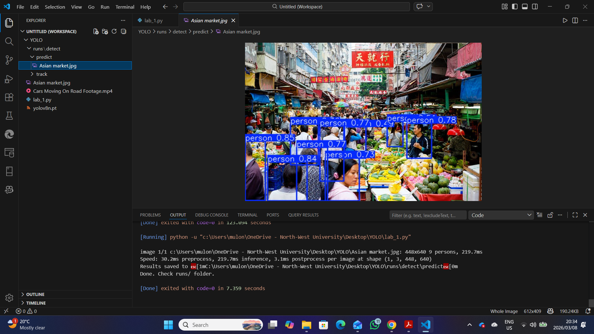
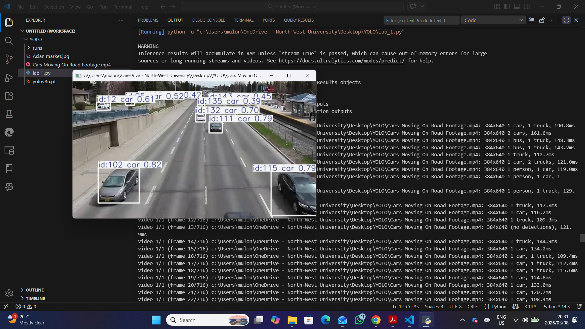
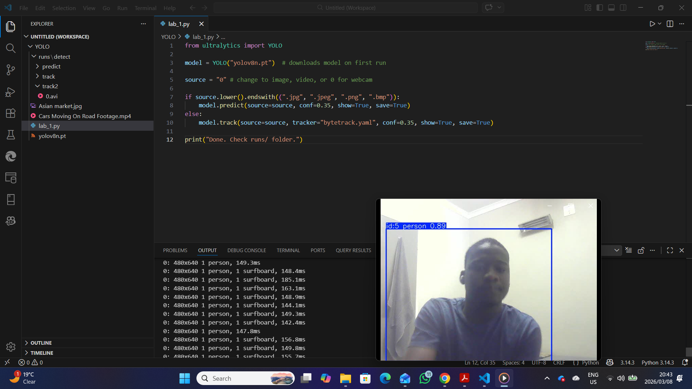

# Real-Time Object Detection and Tracking with YOLOv8

A professional computer vision project that applies YOLOv8 to detect and track objects in images, videos, and webcam streams. The project demonstrates how deep learning models can be used for real-time visual analytics, including traffic scenes, public environments, and live camera input.

## Project Overview

Object detection is a core task in applied artificial intelligence and data science. This project uses a pretrained YOLOv8 model to identify objects from different input sources and save the generated results for analysis.

The workflow supports:

- Image-based object detection
- Video-based object tracking
- Real-time webcam object tracking
- Saved prediction outputs for review
- Reproducible command-line execution

## Repository Structure

```text
real-time-object-detection-yolov8/
├── assets/
│   ├── input/
│   │   ├── asian-market.jpg
│   │   └── cars-moving-on-road.avi
│   ├── output/
│   │   └── webcam-output.avi
│   └── screenshots/
│       ├── cmd-asian-market.png
│       ├── cmd-cars-moving.png
│       └── cmd-webcam.png
├── object_detection.py
├── requirements.txt
├── .gitignore
└── README.md
```

## Technologies Used

- Python
- Ultralytics YOLOv8
- OpenCV
- ByteTrack
- Computer Vision
- Deep Learning Inference

## Installation

Clone the repository and install the required dependencies.

```bash
git clone https://github.com/mulondimbodi/real-time-object-detection-yolov8.git
cd real-time-object-detection-yolov8
pip install -r requirements.txt
```

## Usage

### Run object detection on an image

```bash
python object_detection.py --source "assets/input/asian-market.jpg" --mode detect
```

### Run object tracking on a video

```bash
python object_detection.py --source "assets/input/cars-moving-on-road.avi" --mode track
```

### Run real-time webcam tracking

```bash
python object_detection.py --source 0 --mode track
```

### Optional parameters

```bash
python object_detection.py --source "assets/input/asian-market.jpg" --mode detect --confidence 0.35 --model yolov8n.pt
```

## Results

### Image detection demo



### Video tracking demo



### Webcam tracking demo



Generated YOLO outputs are saved automatically in the `runs/` directory when the script is executed.

## Data Science Relevance

This project demonstrates practical data science and AI skills including:

- Applying pretrained deep learning models to real-world visual data
- Processing image, video, and webcam input sources
- Performing object detection and multi-object tracking
- Using confidence thresholds to control prediction quality
- Structuring a reproducible computer vision workflow
- Communicating model results through screenshots and saved outputs

## Future Improvements

- Add custom model training on a domain-specific dataset
- Compare YOLOv8 model variants by speed and accuracy
- Export detections to CSV or JSON for downstream analytics
- Build a dashboard for visualizing object counts over time
- Add Docker support for reproducible deployment

## Author

Created by Mulondi Mbodi as part of a professional AI and Data Science portfolio.
